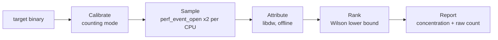

# CacheLens

CacheLens is a Linux command-line profiler that finds **the source lines that use the cache
badly**, not just the lines that run the most. It samples hardware cache-miss and
cache-reference events directly through `perf_event_open`, attributes every sample to a
`file:line` with `libdw`, and ranks lines by **miss concentration** (misses per access at that
line, scored by a Wilson lower bound) instead of raw miss count.

Most profilers rank by raw miss count, and raw miss count mostly re-finds the hottest loop: code
that runs more collects more samples whether or not it has a locality problem. CacheLens asks a
different question: *of the memory accesses made at this line, how many miss?* It is one
self-contained C++17 binary: no `perf` CLI underneath, no `addr2line` subprocess, no Python. It
comes with a set of paired benchmarks and a measurement record showing where the method works
and where it falls short.

## Documentation

| Document | What it covers |
| --- | --- |
| [`docs/ARCHITECTURE.md`](docs/ARCHITECTURE.md) | Design of the four-stage pipeline, the ranking metric, and where the shipped code departs from the spec |
| [`docs/TAKEAWAYS.md`](docs/TAKEAWAYS.md) | Debugging log: every real bug found, its root cause, and why it wasn't obvious |
| [`docs/GATE7_PLAN.md`](docs/GATE7_PLAN.md) | Multithreaded-target design, unknowns register, and the pre-registered false-sharing prediction |
| [`docs/GATE7_IMPLEMENTATION.md`](docs/GATE7_IMPLEMENTATION.md) | How each Gate 7 unknown was closed, phase by phase |
| [`probes/README.md`](probes/README.md) | Four standalone kernel/PMU probes kept as evidence |
| [`results/`](results/) | Raw measurement records, each with its environment block attached |

## The Headline Result

On `matrix_bad` (naive i-j-k matrix multiply), raw miss count and concentration pick
**different lines** as the bottleneck:

| Line | What it is | Raw misses | Raw rank | Concentration (Wilson LB) | Concentration rank |
| --- | --- | ---: | :---: | ---: | :---: |
| `matrix_bad.cpp:43` | loop control, `for (k ...)` | 331,412 | **#1** | 0.059 | #4 |
| `matrix_bad.cpp:44` | `sum += ... * mat(B, k, j)` | 234,147 | #2 | **0.360** | **#1** |

Line 43 runs every iteration, so it collects the most samples no matter what it does. Line 44
walks `B` column by column, and that is the actual locality bug. Concentration ranks it first;
raw count does not. The same split shows up again under the Gate 7 per-CPU sampler
([`results/gate7_phase2_sampler.txt`](results/gate7_phase2_sampler.txt)). Rewriting the loop
in cache-friendly order (`matrix_good`) makes it **2.08–2.10x faster** by wall clock, measured
with stock `perf stat` independently of CacheLens
([`results/phase1_matrix.txt`](results/phase1_matrix.txt)).

## Basic Features

| **Feature**                                                  | **CacheLens**      |
| ------------------------------------------------------------ | ------------------ |
| Direct `perf_event_open` sampling (not a `perf` wrapper)     | :heavy_check_mark: |
| In-process DWARF line attribution via `libdw`                | :heavy_check_mark: |
| Concentration ranking (Wilson score lower bound, 95%)        | :heavy_check_mark: |
| Raw miss-count ranking printed alongside for comparison      | :heavy_check_mark: |
| Minimum-support gate, with excluded sites listed (not hidden)| :heavy_check_mark: |
| Automatic per-run sample-period calibration                  | :heavy_check_mark: |
| Exact run replay with `--period N`                           | :heavy_check_mark: |
| Multithreaded targets (per-CPU rings, `inherit=1`)           | :heavy_check_mark: |
| Lost-record, throttle and multiplexing accounting            | :heavy_check_mark: |
| Sample bucketing: target / shared lib / kernel / unmapped    | :heavy_check_mark: |
| Drain-path latency self-measurement                          | :heavy_check_mark: |
| Precise sampling (Intel PEBS / AMD IBS / Arm SPE)            | :x:                |
| PIE executables                                              | :x:                |
| Line attribution inside shared libraries                     | :x: (bucketed only)|
| Inline-frame expansion                                       | :x:                |
| System-wide or multi-process profiling                       | :x:                |
| JSON / machine-readable output                               | :x:                |
| macOS, Windows, or VMs without a virtualized PMU             | :x:                |

### Knowledge Prerequisites

**Note: CacheLens is simple to run, but its output takes some background to read correctly.**
You should know the basics of the CPU cache hierarchy, how sampling profilers work (periods,
skid, lost samples), and what a DWARF line table can and cannot tell you. Concentration is a
ratio of two event streams sampled *independently*. It is not per-access ground truth, and on
hardware without precise sampling it inherits skid (see [Limitations](#limitations)).
Reading a ranking without that context can point you at the wrong line.

## Requirements

CacheLens needs a **real hardware PMU on Linux**. Most cloud VMs and all Apple Silicon Macs
lack one. Check before building anything:

```bash
# 1. The PMU must return real integers, not "<not supported>":
perf stat -e cache-misses,cache-references,instructions,cycles /bin/true

# 2. Allow per-process profiling without root:
sudo sysctl -w kernel.perf_event_paranoid=1

# 3. Build dependencies (Debian/Ubuntu):
sudo apt install build-essential cmake pkg-config libdw-dev
```

| Component | Required | Tested with |
| --- | --- | --- |
| OS | Linux with `perf_event_open` | Ubuntu, kernel `7.0.0-29-generic` |
| CPU | Hardware PMU exposing `cache-misses` / `cache-references` | AMD Ryzen 5 7600X (Zen 4), 12 logical CPUs |
| Compiler | C++17 | g++ 15.2.0 |
| Build | CMake ≥ 3.16, `pkg-config` | — |
| Library | elfutils `libdw` / `libelf` | — |

## Quick Build

```bash
git clone https://github.com/efazman/CacheLens.git
cd CacheLens

cmake -S . -B build && cmake --build build     # -> ./build/cachelens (RelWithDebInfo)
make -C benchmarks                             # matrix_bad, matrix_good, pointer_chase
```

Optional benchmark sets: `make -C benchmarks queues` (SPSC/MPMC false-sharing pairs) and
`make -C benchmarks latency` (open-loop latency harness).

## Verifying the Build

There is no unit-test suite. The check is end-to-end: run the tool on the benchmark whose
answer is already known.

```bash
./build/cachelens -- ./benchmarks/matrix_bad
```

A working install ranks **`matrix_bad.cpp:44` #1 by concentration** and
**`matrix_bad.cpp:43` #1 by raw count**, reports `lost_records=0`, and attributes over 99.9% of
samples to the target executable. If `perf_event_open` fails, CacheLens prints a diagnosis
(`perf_event_paranoid` too strict, or the event isn't implemented by this PMU) and exits
non-zero.

## Example

### Profiling your own program

```bash
g++ -O1 -g -fno-omit-frame-pointer -no-pie -o myprog myprog.cpp
./build/cachelens -- ./myprog --its --own --args
```

| Flag | Why it matters |
| --- | --- |
| `-g` | DWARF line tables are the only thing attribution reads. Without them CacheLens refuses to run. |
| `-no-pie` | Attribution is offline against the ELF on disk, so the link-time address has to equal the runtime address. |
| `-fno-omit-frame-pointer` | Not needed by CacheLens, which doesn't unwind stacks. It keeps builds comparable with stock `perf record -g` runs. |
| `-O1` rather than `-O2` | Recommended when comparing two builds. At `-O2`, GCC vectorizes one matrix loop but not the other, which confounds the comparison. |

### What a run does

1. **Calibrate:** runs the target once in counting mode to measure real event rates, then picks
   a prime sample period per event at 60% of the kernel's `perf_event_max_sample_rate`.
2. **Sample:** runs it again with two independent sampling events (misses, references) per
   online CPU, each on its own mmap ring, armed exactly at `execve` by `enable_on_exec`.
3. **Attribute:** resolves each sampled IP to `file:line` with `libdw`, and buckets samples
   outside the target instead of guessing.
4. **Rank:** scales both counts by their periods, computes misses/accesses per line, and
   ranks by Wilson lower bound. Lines with fewer than 30 access samples are listed separately.

### Reading the output

The final section of a `matrix_bad` run
([`results/gate5_concentration.txt`](results/gate5_concentration.txt)):

```
period[miss]: 4099 (calibrated)
period[access]: 47017 (calibrated)
...
record histogram: sample=565843 lost_records=0 lost_events=0 exit=0 other=0
bucket[target executable]: 565721 (99.9784%)
attributed: 565721, unattributed: 0 (0.0000%)
...
=== concentration ranking (Wilson lower bound, 95%, min 30 access samples) ===
  #1  matrix_bad.cpp:44  miss=234147 access=56750  concentration=0.359704  wilson_lb=0.359683
  #2  matrix_bad.cpp:41  miss=83 access=71  concentration=0.101916  wilson_lb=0.098922
  #3  matrix_bad.cpp:42  miss=79 access=77  concentration=0.089446  wilson_lb=0.087267
  #4  matrix_bad.cpp:43  miss=331412 access=492522  concentration=0.058663  wilson_lb=0.058549
insufficient samples (< 30 access samples), excluded from ranking (2 sites):
  matrix_bad.cpp:30  miss=0 access=22
  matrix_bad.cpp:31  miss=0 access=17

=== raw miss-count ranking (for comparison) ===
  #1  matrix_bad.cpp:43  miss=331412
  #2  matrix_bad.cpp:44  miss=234147
```

| Field | Meaning |
| --- | --- |
| `period[...]` | Events per sample. Pass it back with `--period N` to replay a run exactly. |
| `lost_records` / `lost_events` | Samples the kernel dropped. Non-zero means the ring drain fell behind. |
| `bucket[...]` | Where sampled IPs landed: target, shared library, kernel, or unmapped. Only target samples are ranked. |
| `concentration` | Period-scaled misses ÷ accesses at the line: a density ratio, not a per-access fact. |
| `wilson_lb` | The lowest concentration consistent with the evidence. A line needs a high ratio **and** enough samples to rank. |

### Replaying a run

```bash
./build/cachelens --period 50000 -- ./benchmarks/matrix_bad
```

`--period N` skips calibration and applies `N` to both events. The throttle halt stays active.

## Architecture



Everything lives in one file, [`src/main.cpp`](src/main.cpp) (~1,025 lines), in banner-commented
sections that follow the pipeline order. Why it is one file, and every other place the code
departs from the original spec, is recorded in [`docs/ARCHITECTURE.md`](docs/ARCHITECTURE.md).

**Why a Wilson lower bound?** A plain ratio lets a low-traffic line with a lucky 3/3 sample
outrank the real bottleneck. The Wilson lower bound scores 3/3 at about 0.44 and 3,000/4,000 at
about 0.74, so evidence wins over noise. Lines below the 30-sample support gate are printed as
insufficient, not silently dropped.

## Benchmarks

| Benchmark | Access pattern | `make` target | Flags | Before/after pair |
| --- | --- | --- | --- | :---: |
| `matrix_bad` / `matrix_good` | i-j-k vs i-k-j matrix multiply, N=2400 | `all` | `-O1` | :heavy_check_mark: |
| `pointer_chase` | Linked list with nodes scattered across the heap | `all` | `-O1` | :x: |
| `spsc_queue_{shared,padded}` | SPSC queue, head/tail indices on one line vs two | `queues` | `-O1` (+`_O2`) | :heavy_check_mark: |
| `mpmc_queue_{shared,padded}` | Vyukov MPMC queue under 4-core contention | `queues` | `-O1` (+`_O2`) | :heavy_check_mark: |
| `queue_latency_{shared,padded}` | Open-loop, rate-controlled SPSC latency harness | `latency` | `-O2` | :heavy_check_mark: |

Each padded/shared pair is built from **one source file** with `-DCACHELENS_PAD_INDICES=0|1`, so
the two builds differ in exactly one thing. `objdump` confirms the field offsets.

## Case Studies

| Study | Result | Record |
| --- | --- | --- |
| **Matrix locality** | Concentration picks line 44, raw count picks line 43. The fixed loop runs 2.08–2.10x faster, with miss rate dropping from 8.99% to 1.23%. | [`gate5_concentration`](results/gate5_concentration.txt), [`phase1_matrix`](results/phase1_matrix.txt), [`drift_investigation`](results/drift_investigation.txt) |
| **False sharing (SPSC queue)** | Padded build runs 2.75–3.62x faster. A pre-registered *which-line* prediction **failed**: the largest padding response (+673%) landed one instruction past the index store, which is skid. The mechanism prediction held. | [`gate7_false_sharing`](results/gate7_false_sharing.txt), [`GATE7_PLAN.md` §0](docs/GATE7_PLAN.md) |
| **Tail latency** | At 500k ops/s, false sharing raises p50/p99 by 10–20%. p99.9 and above is dominated by OS scheduling noise. The governor has no effect on typical latency but does change the shape of the tail. | [`gate7_latency`](results/gate7_latency.txt) |
| **Profiler overhead** | Worst drain iteration was 495 µs against ~3.3 s of ring headroom, with zero lost records. The target ran ~17% *faster* under CacheLens. That is still unexplained and is reported as open. | [`gate7_drain`](results/gate7_drain.txt) |
| **Governor null result** | `performance` vs `powersave` differed by 0.07–0.11% on `matrix`. This corroborates that the speedup came from eliminated stalls (IPC ≈1.57 → ≈3.73). | [`drift_investigation`](results/drift_investigation.txt) |

Each record lists the environment it was measured in, and failed predictions are reported with
the data that explains them.

## Limitations

- **No precise sampling.** Zen 4 rejects `precise_ip` 1 and 2 (`ENOENT`), so samples have
  unbounded skid. On `matrix_bad`, 99.99% of samples landed within ±2 lines, but that is
  **specific to that workload**. On the SPSC queue, skid visibly moved the signal.
- **Generalized events.** CacheLens uses the kernel's `PERF_COUNT_HW_CACHE_MISSES` /
  `_REFERENCES`. Nobody has checked with raw PMU codes that on Zen 4 these count LLC activity
  only.
- **`-no-pie` required.** PIE support needs `PERF_RECORD_MMAP2` tracking and is deliberately
  deferred.
- **Inlined code attributes to the call site.** Both matrix benchmarks are fully inlined into
  `main` at `-O1`.
- **Multithreading costs file descriptors.** It uses 2 events × online CPUs rings: 24 fds and
  24 × 512 KiB rings on a 12-CPU machine.
- **One machine, one configuration.** Everything was measured on a single Ryzen 5 7600X
  (32 MiB L3, single-channel DDR5, THP `madvise`) and has not been reproduced elsewhere.

The full reasoning behind each limitation is in [`docs/ARCHITECTURE.md`](docs/ARCHITECTURE.md)
and [`docs/TAKEAWAYS.md`](docs/TAKEAWAYS.md).

## Reproducing Measurements

A performance number is not reproducible without its environment, not even by the person
who measured it. Every ground-truth measurement goes through a script that records governor,
load, THP, `perf_event_paranoid`, kernel, compiler, build flags, and core frequencies next to
the numbers:

| Script | Produces |
| --- | --- |
| [`scripts/measure_baseline.sh`](scripts/measure_baseline.sh) `<out> <label>` | `perf stat -r 5` on both matrix benchmarks, with environment block |
| [`scripts/measure_queue.sh`](scripts/measure_queue.sh) | Padded/shared queue A/B plus `objdump` layout evidence |
| [`scripts/measure_latency.sh`](scripts/measure_latency.sh) | 5 latency-harness runs under the current governor |
| [`scripts/run_gate7_probes.sh`](scripts/run_gate7_probes.sh) | Builds and runs probes P1–P4 |

## Repository Layout

```
src/main.cpp        the entire profiler
benchmarks/         paired workloads with known answers, plus their Makefile
probes/             standalone kernel/PMU probes (not cachelens code)
scripts/            measurement scripts that attach an environment block
results/            raw measurement records
docs/               architecture, debugging log, Gate 7 plan and implementation
docs/archive/       pre-rearchitecture design docs, kept for history
```

## Future Work

- **AMD IBS** (`/sys/bus/event_source/devices/ibs_op`) is AMD's route to instruction-level
  precision. It needs a dynamic PMU type and a different record layout. It was deferred because
  skid was absorbed on the original benchmark, but the Gate 7 queue result shows why it matters.
- **PIE support** via `PERF_RECORD_MMAP2` tracking.
- **Splitting `main.cpp` into modules** as designed in `ARCHITECTURE.md` §1.1.
- **Reproduction on a second machine**, ideally Intel, where the `precise_ip` ladder would come
  back.

## Citing the Project

```bibtex
@software{rahman2026cachelens,
  author = {Rahman, Efaz},
  title  = {CacheLens: Concentration-Ranked Cache-Miss Profiling on Linux},
  year   = {2026},
  url    = {https://github.com/efazman/CacheLens}
}
```

## Maintainer

Built and maintained by [Efaz Rahman](https://github.com/efazman). Issues and pull requests are
welcome, especially reproductions on hardware other than Zen 4.

## Acknowledgments

CacheLens builds on the Linux `perf_event_open(2)` interface and its man-page documentation of
the mmap ring-buffer protocol, on [elfutils](https://sourceware.org/elfutils/) `libdw` for DWARF
line lookup, and on stock `perf`, which served as the independent reference every CacheLens
number was checked against. The bounded MPMC benchmark follows Dmitry Vyukov's per-slot-sequence
queue design.
